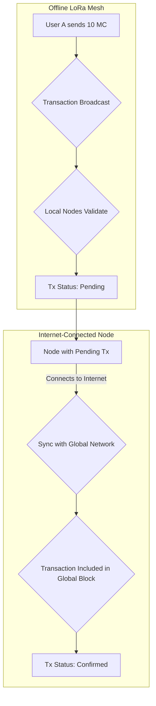

> This document outlines the official MeshChain architecture, which has been revised to prioritize decentralization, offline-first operation, and network resilience. This model supersedes all previous designs, including the validator/super-validator distinction.

# MeshChain Core Architecture

## 1. Guiding Principles

The MeshChain architecture is built on three fundamental principles:

- **True Decentralization**: Every node is a peer. There are no special roles or privileged nodes. This eliminates single points of failure and ensures the network remains censorship-resistant.
- **Offline-First Operation**: The network is designed to function seamlessly on isolated LoRa mesh networks without internet access. Users must be able to create wallets, send transactions, and validate blocks locally.
- **Eventual Consistency**: Disconnected networks (or "partitions") can operate independently. When they reconnect to the internet or each other, they reconcile their states to form a single, canonical blockchain.

---

## 2. The Unified Node Model

MeshChain employs a **unified node model**. Every participant in the network runs the same software and performs the same core functions. The distinction between "users," "validators," and "super validators" has been eliminated.

**Every node is a full node.**

This means every ESP32 device running MeshChain:
- **Stores the Full Blockchain**: The complete, unabridged history of all transactions is stored on a standard microSD card.
- **Validates All Transactions**: Every node independently validates every transaction against the full blockchain history, ensuring maximum security.
- **Participates in Consensus**: Every node contributes to the consensus mechanism to agree on the state of the ledger.

| Feature | Implementation | Rationale |
| :--- | :--- | :--- |
| **Node Role** | Unified Full Node | Eliminates complexity and single points of failure. Promotes true decentralization. |
| **Storage** | Full Blockchain on microSD | Commodity microSD cards offer ample, low-cost storage for years of transaction history. |
| **Validation** | Independent Full Validation | Prevents invalid transactions and ensures all nodes operate on the same set of rules. |

---

## 3. The Two-Level Confirmation System

To balance the needs of offline usability and global consistency, MeshChain uses a two-level transaction confirmation system. This provides users with immediate feedback while ensuring the finality of transactions once they reach the global network.

### Level 1: Local Confirmation (Pending)

When a user initiates a transaction on a local mesh network, it is immediately broadcast to nearby nodes.

- **Confirmation**: The transaction is validated by the local peers on the mesh network.
- **Status**: The transaction is marked as **`Pending`**.
- **Usability**: The funds are immediately reflected in the recipient's local wallet balance but are not yet considered final. This allows for fluid, real-time commerce within an offline mesh.
- **Reversibility**: A `Pending` transaction can be reversed if the local network partition later syncs with a longer, conflicting blockchain.

### Level 2: Global Confirmation (Confirmed)

When a node with `Pending` transactions connects to the internet (or to another mesh with internet access), it syncs its blockchain with the global network.

- **Confirmation**: The transaction is included in a block that is accepted by the global consensus of all internet-connected nodes.
- **Status**: The transaction is upgraded to **`Confirmed`**.
- **Finality**: Once `Confirmed`, a transaction is immutable and cannot be reversed.

This two-level system provides the best of both worlds: the instant utility of an offline payment system and the robust security of a globally consistent blockchain.

---

## 4. Network Partitions and Reconciliation

The architecture explicitly embraces the reality of network partitions in a mesh environment.

- **Independent Operation**: An isolated mesh network (e.g., a single town or a remote area) can continue to create blocks and confirm transactions locally (`Pending` state).
- **Reconciliation**: When this network partition reconnects to the main network, it syncs its version of the blockchain with the global chain.
- **Consensus Rule**: The **longest valid chain** is accepted as the canonical truth. All nodes (both in the partition and on the global network) will adopt this chain.
- **Transaction Handling**: Transactions from the shorter, abandoned chain are effectively "un-confirmed." The funds revert to the original senders, and the transactions can be re-broadcast to be included in the canonical chain.

This "longest chain" rule is a well-established principle in blockchain systems like Bitcoin and ensures that the network eventually converges on a single, shared history, even in the face of significant network fragmentation.
